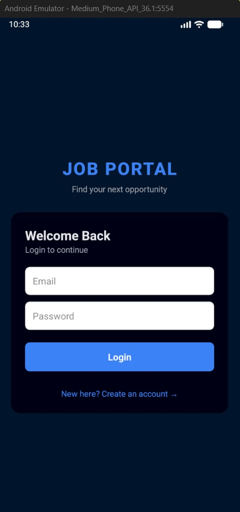
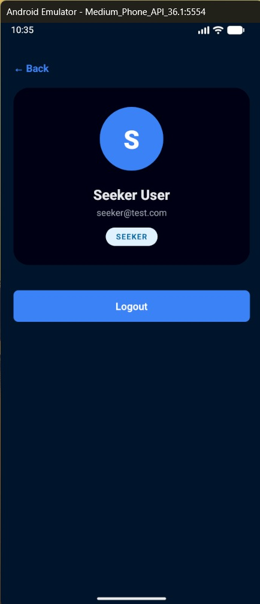
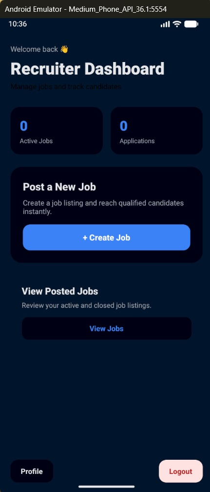
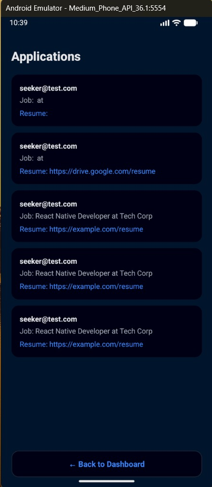

# 💼 Job Portal Application (Full Stack – Mobile App)

A modern **role-based Job Portal mobile application** built using **React Native (Expo)** and a **Node.js + MongoDB backend**, inspired by real-world job platforms like LinkedIn and Indeed.

---

## 📱 Screenshots

> Add your screenshots here 👇  
(Recommended size: mobile screenshots, 2–3 per row)
### 🔐 App


### 🔐 Authentication



### 👤 Job Seeker Dashboard




### 🧑‍💼 Recruiter Dashboard



### 🛠 Admin Dashboard




---

## 🚀 Features

### 👤 Authentication & Roles
- Secure Login & Registration (JWT)
- Role-based access:
  - **Seeker**
  - **Recruiter**
  - **Admin**

### 🔍 Job Seeker
- Search and browse jobs
- View detailed job descriptions
- Apply for jobs
- Profile management

### 🧑‍💼 Recruiter
- Post new jobs
- View posted jobs
- Track applications
- Analytics dashboard (Active jobs & applications)

### 🛠 Admin
- View platform analytics
- Monitor users, jobs, and applications
- Separate admin dashboard

---

## 🧱 Tech Stack

### Frontend (Mobile)
- React Native
- Expo
- Expo Router
- Context API
- Axios

### Backend
- Node.js
- Express.js
- MongoDB
- Mongoose
- JWT Authentication

---

## 📂 Project Structure

```bash
job-portal-app/
├── job-portal-backend/
│   ├── controllers/
│   ├── models/
│   ├── routes/
│   ├── middleware/
│   └── server.js
│
├── job-portal-mobile/
│   ├── app/
│   ├── components/
│   ├── context/
│   ├── services/
│   └── utils/
```
## ⚙️ Project Setup

### 🔧 Backend Setup
```bash
cd job-portal-backend
npm install
npm start
```

### 🔧 Frontend Setup
```bash
cd job-portal-mobile
npm install
npx expo start
```

### 🔐 Environment Variables
```
Create a .env file in backend:

MONGO_URI=your_mongodb_url
JWT_SECRET=your_secret_key
PORT=5000
```
### 📌 Future Improvements

- Resume upload feature
- Job bookmarking
- Notifications
- Admin user management
- Cloud deployment

### 👨‍💻 Author

Soumyajeet Saha
Full Stack Developer (MERN + React Native)

### 🔗 GitHub Repository:
https://github.com/Soumyajeet2004/job-portal-app
